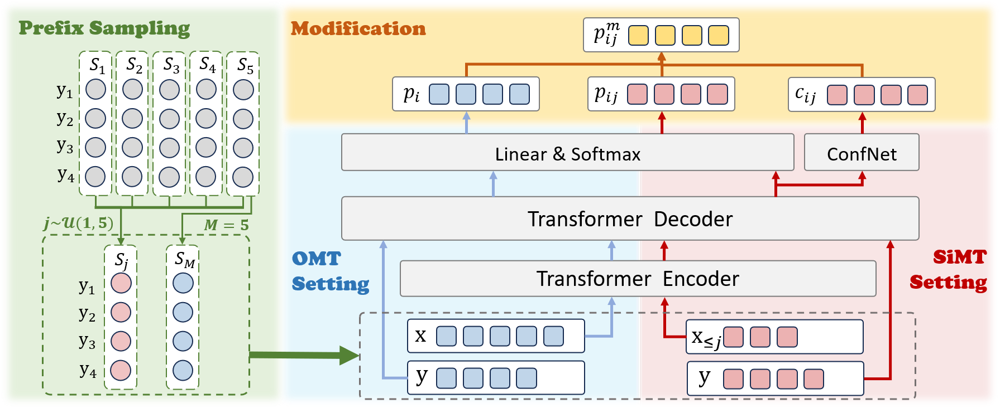

# Self-Modifying State Modeling for Simultaneous Machine Translation

Source Code for ACL 2024 main conference paper "Self-Modifying State Modeling for Simultaneous Machine Translation".



Our model is implemented based on the open-source toolkit [Fairseq](https://github.com/facebookresearch/fairseq) and the open-source code [ITST](https://github.com/ictnlp/ITST).

## Requirements and Installation

- Python >= 3.7.10

- torch >= 1.13.0

- sacrebleu = 1.5.0

- Install the Fairseq with the following commands:

  ```shell
  git clone https://github.com/EurekaForNLP/SM2.git
  cd SM2
  pip install --editable ./
  ```

## Quick Start

### Data Processing

- We tokenize the English, German, Romanian corpus with  [mosesdecoder/scripts/tokenizer/tokenizer.perl](https://github.com/moses-smt/mosesdecoder/blob/master/scripts/tokenizer/tokenizer.perl) and Chinese corpus with [fxsjy/jieba](https://github.com/fxsjy/jieba). 
- We apply BPE with [rsennrich/subword-nmt](https://github.com/rsennrich/subword-nmt).
- We preprocess the data into fairseq format with [preprocess.sh](preprocess.sh), adding `--joined-dictionary` for German-English.

### Training

Use [train_sm2.sh](train_sm2.sh) to finish Training SM$^2$. It is noted that:

- The `--arch transformer_with_sm2_unidirectional` for SM$^2$ with unidirectional encoder settings.
- If the used device supports bf16, `--bf16` is suggested.
- If source and target language share embeddings, use `--share-all-embeddings`.

### Inference

Use [test_sm2.sh](test_sm2.sh) to finish the inference process of simultaneous translation with `--batch-size=1` and `--beam=1`